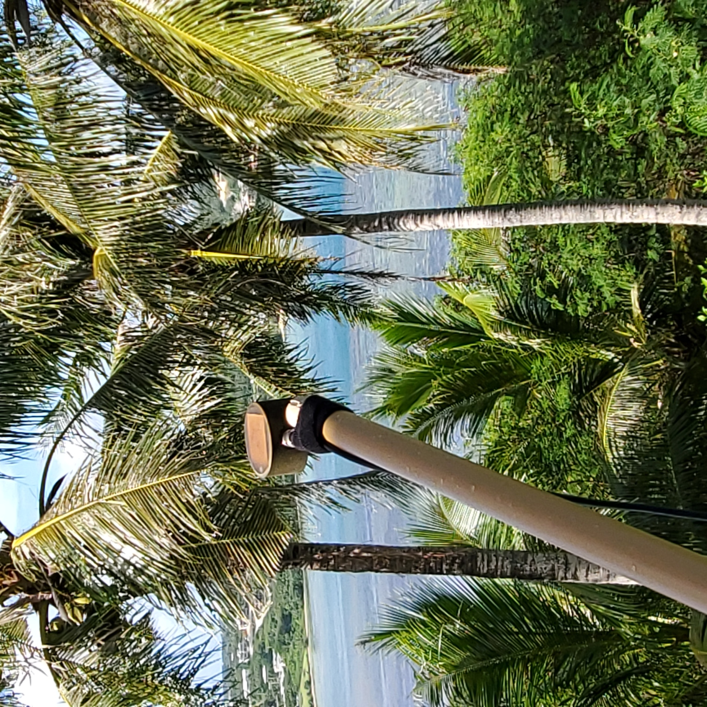
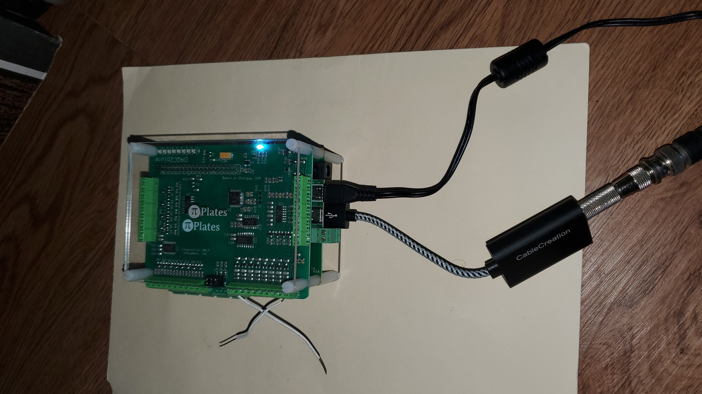
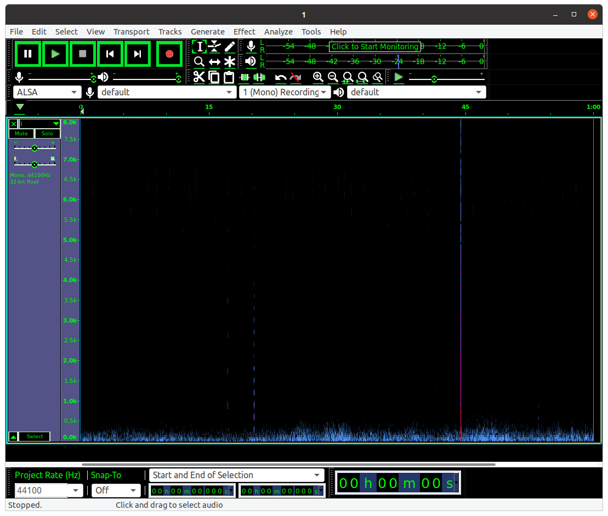
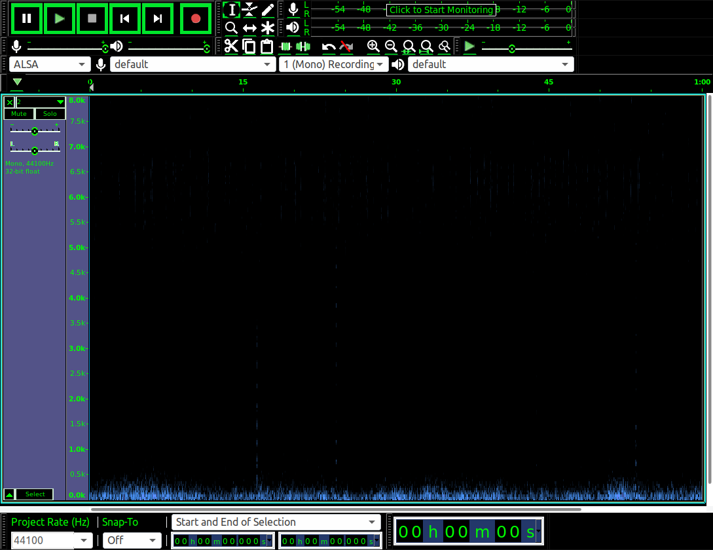
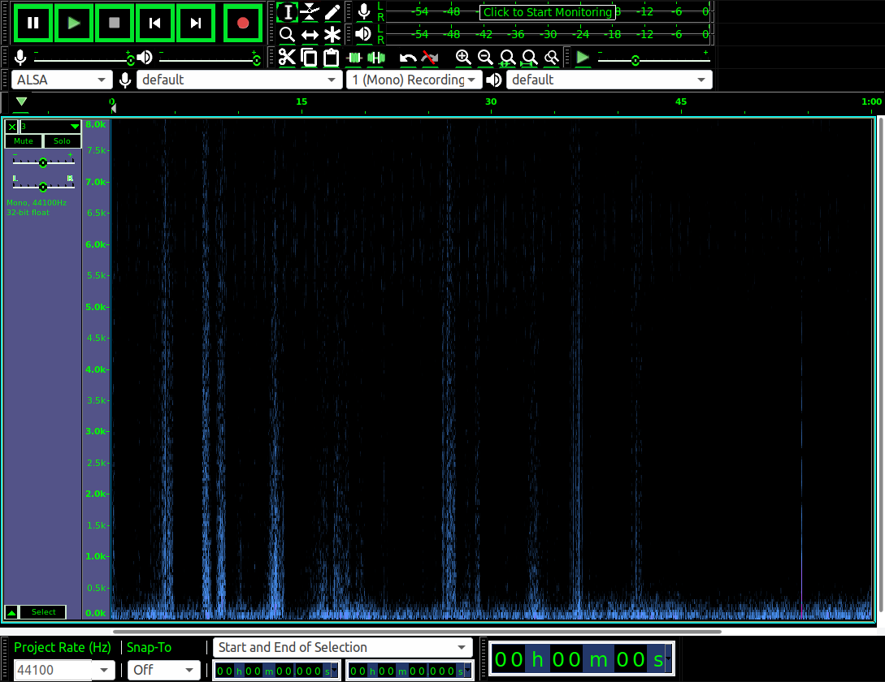

# InsectWingbeat
This repo documents my initial attempts to record insect wingbeat waveforms using an optical sensor and a Raspberry Pi.

In the late 80s and early 90s I did a bit of work on automated monitoring and identification of flying insects using waveforms collected by very simple none-imaging optical sensors. My contribution to the field was to suggest characterizing insect wingbeat waveforms using harmonic content in addition to the wingbeat frequency (=fundamental frequency). Hardware and software has certainly changed a lot since then. Just for fun, I decided to hook one of my old sensors to a Raspberry Pi via a USB sound adaptor to see what kind of signals I could capture with minimum effort. Here's my setup:

## Hardware

The sensor is just a miniature solar cell connected to a small transformer which removes the DC component of the waveform (Fig. 1). Output from the sensor was connected to a Raspberry Pi 3 Model B+ single board computer using a [CableCreation USB sound adaptor](https://www.amazon.com/Adapter-CableCreation-External-Windows-Drivers/dp/B01H2XF8V8/ref=sr_1_2?crid=1E0WFV1MHW6X3&dchild=1&keywords=usb+sound+adapter&qid=1628557916&refinements=p_89%3ACableCreation%7CCreative&rnid=2528832011&s=electronics&sprefix=usb+sound+%2Caps%2C346&sr=1-2) (Fig.2).

## Software

### Recording 

For recording, I installed Audacity 2.2.2 on my Raspberry Pi 3+ running Raspbian 10 and was pleasantly surprised that it ran very well. I operated the Raspberry Pi remotely using VNC.

### Analysis

For analysis, I installed the [Ecoacoustics Audio Analysis Software](https://ap.qut.ecoacoustics.info/) software on my Ubuntu 20.04 laptop.

## Experiment

* In this experment, I recorded insects flying between the sun an the sensor.
* I taped the sensor to the end of a 6 foot wooden pole and placed it in the direct sun just outside the balcony of my apartment. The sensor was connected to the USB sound adaptor using a 10 foot cable with appropriate connectors.
* I used Audacity to record four one-minute mono WAV files at a sample rate of 44100 Hz. Recordings were made on August 2020 between 11:30am and 11:40am in Yona, Guam. Weather was mostly sunny with light winds.

## Results

A few insect signals can be heard during playback of the recordings. Some of these are clearly visible in spectrograms (Figures 3,4,5,6).

Fig. 1 Sensor.

Fig 2. Raspberry Pi with USD sound adaptor.

Figure 3. Spectrogram of 1.wav. Note the insect wingbeat harmonic series at about 20s.

Figure 4. Spectrogram of 2.wav.

Figure 5. Spectrogram of 3.wav. These signals are probably caused by parts of a small cloud moving over the sun.

Figure 6. Spectrogram of 4.wav.
