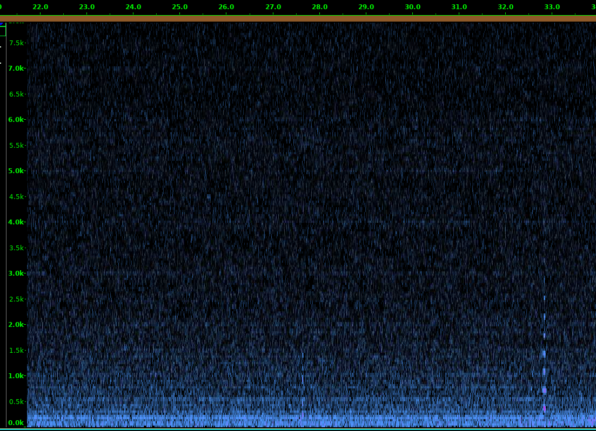

# Converting a Solar Powered Path Marker into an Insect Wingbeat Waveform Photosensor

One of those cheap solar powered garden path markers available in most hardware stores can be easily converted into an insect wingbeat waveform photosensor following these steps:
* Remove the LED, circuit board and rechargable battery.
* Drill a hole in the side of the case to accept an audio cable.
* Solder the wires from the solar cell to one side of a miniature transformer (Fig. 1). 
[I got my transformer from Amazon](https://www.amazon.com/dp/B073PXK2RX?psc=1&ref=ppx_yo2_dt_b_product_details).
* Solder the other side of the transformer to a cable with a 3.5 mm phono plug (Fig. 1).

Figures 2 and 3 show the finished product.
Now you can plug the sensor into a recording device to record transient waveforms caused by insects flying between the sun and the sensor (Fig. 4)

 <b>Figure 1. Simple sensor, schematic.</b>

 <b>Figure 2. Simple sensor, bottom view.</b>

 <b>Figure 3. Simple sensor, top view.</b>

 <b>Figure 4. First recording made when the sensor was placed in the sun and plugged into a Raspberry Pi equipped with a USB sound adaptor. This is a screenshot of an Audacity spectrogram. Two insect wingbeat waveforms are clearly visible.</b></p
